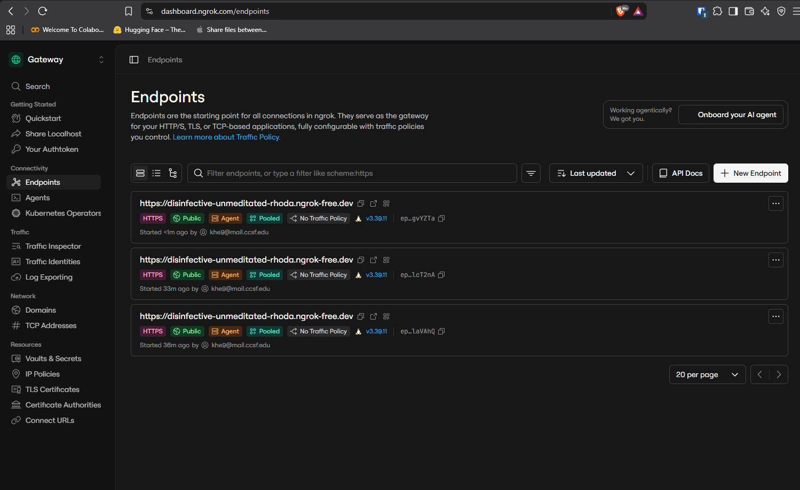

# Pi 3B OAuth tunnel for Zoom + Calendly

One local Python proxy + one ngrok HTTPS domain.

## What it does

| Path | Purpose |
|------|---------|
| `/callback` | Zoom OAuth redirect capture |
| `/authorize` | Redirects to `calendly.com/oauth/authorize` |
| `/token`, `/register` | Forwarded to Calendly OAuth |
| `/.well-known/*` | Discovery that points authorize/token correctly |
| everything else | Proxied to `https://mcp.calendly.com` |

## Pi 3B install

```bash
# 1) Install Python + curl
sudo apt update
sudo apt install -y python3 python3-venv curl

# 2) Install ngrok (Pi 3B is usually armv7; use arm64 if your OS is 64-bit)
uname -m
# armv7l / armhf:
curl -fsSL -o /tmp/ngrok.tgz https://bin.equinox.io/c/bNyj1mQVY4c/ngrok-v3-stable-linux-arm.tgz
# aarch64:
# curl -fsSL -o /tmp/ngrok.tgz https://bin.equinox.io/c/bNyj1mQVY4c/ngrok-v3-stable-linux-arm64.tgz
sudo tar -xzf /tmp/ngrok.tgz -C /usr/local/bin ngrok
ngrok version

# 3) Copy this folder to the Pi, e.g. /home/pi/pi-oauth-tunnel
# 4) Put your AGENT authtoken in ngrok.yml (not the API key)
nano ~/pi-oauth-tunnel/ngrok.yml

# 5) Run once
chmod +x ~/pi-oauth-tunnel/run.sh
~/pi-oauth-tunnel/run.sh
```

Optional systemd:

```bash
sudo cp ~/pi-oauth-tunnel/oauth-tunnel.service /etc/systemd/system/
sudo systemctl daemon-reload
sudo systemctl enable --now oauth-tunnel
sudo journalctl -u oauth-tunnel -f
```

## Wire Zoom

1. Zoom app → OAuth Redirect URL + Allow List:
   `https://disinfective-unmeditated-rhoda.ngrok-free.dev/callback`
2. Authorize with that redirect_uri.
3. Code lands in `data/zoom_last_callback.json` on the Pi.

## Wire Calendly MCP

Add MCP server:

- name: `calendly`
- url: `https://disinfective-unmeditated-rhoda.ngrok-free.dev`

Do **not** point Calendly MCP at `https://mcp.calendly.com` if the client builds `/authorize` on the MCP host. Point it at this tunnel instead.

## Health check

```bash
curl -s https://disinfective-unmeditated-rhoda.ngrok-free.dev/healthz
curl -sI "https://disinfective-unmeditated-rhoda.ngrok-free.dev/authorize?response_type=code&client_id=test"
# expect 302 Location: https://calendly.com/oauth/authorize?...
```

## ngrok verification

Endpoint is live in the [ngrok dashboard](https://dashboard.ngrok.com/endpoints) as a pooled HTTPS agent tunnel:


